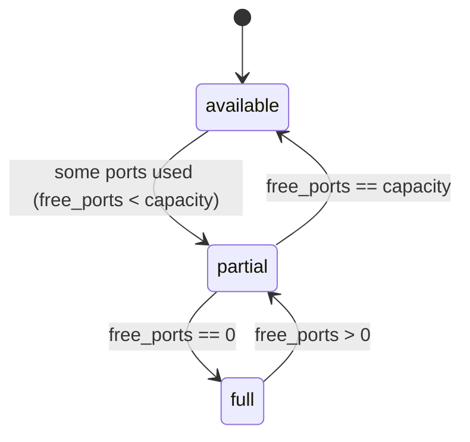
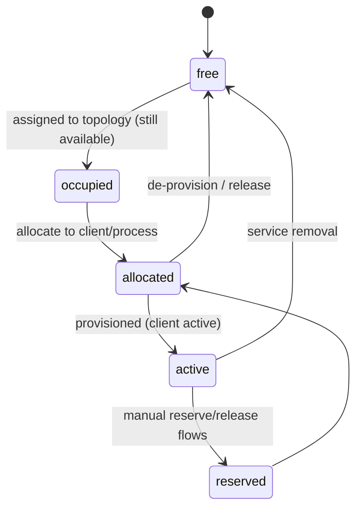
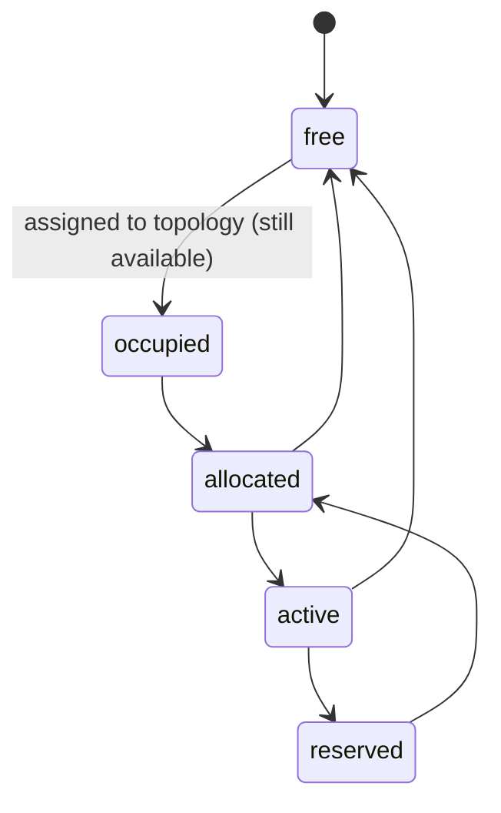

# FTTH — Documentación técnica

**Última revisión:** 2026-04-30

Documentación generada a partir del código fuente de los modelos FTTH en `wigo_ftth/models`.

---

## 1. Descripción general del sistema (modelos principales)

- `wigo.ftth.regional` (Regional)
  - Representa una región o ciudad donde existen nodos FTTH.
  - Campos clave: `name`, `prefix`, `active`, `nodo_ids`.
  - Relación: 1:N → `wigo.ftth.nodo`.

- `wigo.ftth.nodo` (Nodo)
  - Nodo de agregación dentro de una `regional`.
  - Campos clave: `name`, `number`, `regional_id`, `olt_ids`.
  - Relación: pertenece a `wigo.ftth.regional` y contiene 0..N `wigo.ftth.olt`.

- `wigo.ftth.olt` (OLT)
  - Terminal óptica que agrupa puertos PON y puede tener una ODN.
  - Campos clave: `node_id`, `technology_id`, `olt_number`, `port_ids`, `odn_ids`, `olt_code`.
  - Relación: 1:N → `wigo.ftth.olt.port`; 0..1 → `wigo.ftth.odn` (constraint `unique(olt_id)`).

- `wigo.ftth.olt.port` (Puerto OLT / Puerto PON)
  - Puerto físico de la OLT que aloja subinterfaces y se asocia con grupos de cajas.
  - Campos clave: `olt_id`, `port_number`, `interface_port`, `capacity_max`, `subinterface_ids`, `box_group_ids`.
  - Controles: cálculo de `used_subinterfaces`, `free_subinterfaces`, `occupancy_percent`.

- `wigo.ftth.odn` (ODN)
  - Red de distribución asociada a una OLT (una ODN por OLT por constraint).
  - Campos clave: `olt_id`, `odn_number`, `odf_port`, `box_group_ids`.
  - Constraint: `_olt_unique = unique(olt_id)` (solo 1 ODN por OLT).

- `wigo.ftth.box.group` (Grupo de cajas / Splitters)
  - Vincula `olt_port` + `odn` + `zone` y agrupa `wigo.ftth.box`.
  - Campos clave: `group_number`, `zone_id`, `olt_port_id`, `odn_id`, `box_ids`, `total_ports`.
  - Regla para "grupo válido" (cobertura): requiere `olt_port_id` y `odn_id`.

- `wigo.ftth.box` (Caja / NAP)
  - Caja NAP con varios puertos cliente.
  - Campos clave: `identifier`, `box_group_id`, `port_capacity` (8/16), `port_ids`, `free_ports`, `state` (`available`, `partial`, `full`).
  - Relacionados (store): `zone_id`, `olt_id`, `olt_port_id` (via `box_group_id`).

- `wigo.ftth.box.port` (Puerto de caja / Puerto NAP)
  - Puerto individual de una `box`.
  - Campos clave: `box_id`, `state` (valores: `free`, `occupied`, `allocated`, `reserved`, `active`).
  - Semántica: `free`/`occupied` = disponibles; `allocated`/`reserved`/`active` = usados.

- `wigo.ftth.subinterface` (Subinterfaz)
  - Subinterfaces lógicas asociadas a `wigo.ftth.olt.port`.
  - Campos clave: `olt_port_id`, `state` (mismos valores que `box.port`).
  - Semántica: `free` = libre; `occupied` = asignada pero considerada disponible; otros estados = usada.

---

## 2. Diagrama de flujo principal (Mermaid)

```mermaid
flowchart TD
  subgraph REG [Regiones]
    REGN[wigo.ftth.regional]
  end
  REGN --> NOD[wigo.ftth.nodo]
  NOD --> OLT[wigo.ftth.olt]
  OLT --> OLT_PORT[wigo.ftth.olt.port]
  OLT --> ODN[wigo.ftth.odn]
  OLT_PORT --> BG[wigo.ftth.box.group]
  ODN --> BG
  BG --> BOX[wigo.ftth.box]
  BOX --> BOX_PORT[wigo.ftth.box.port]
  BOX_PORT --> SUBIF[wigo.ftth.subinterface]

  REGN ---|contains| NOD
  NOD ---|hosts| OLT
  OLT ---|has ports| OLT_PORT
  OLT ---|may have (unique)| ODN
  BG ---|binds| OLT_PORT
  BG ---|binds| ODN
  BOX ---|belongs to| BG
  BOX_PORT ---|belongs to| BOX
  SUBIF ---|belongs to| OLT_PORT
```

Notas:

- `wigo.zone` participa vía `box_group.zone_id` y es usada en cálculos de cobertura (`wigo.zone` en `ftth_zone.py`).

---

## 3. Diagramas de estados (Mermaid)

### A) `wigo.ftth.box` (Caja / NAP)



Condiciones (código):

- `full` cuando `free_ports == 0`.
- `partial` cuando `0 < free_ports < capacity`.
- `available` cuando `free_ports == capacity`.

### B) `wigo.ftth.box.port` (Puerto de caja / NAP)



Semántica extraída del código:

- `free` y `occupied` se consideran disponibles para conteos.
- `allocated`, `reserved`, `active` se consideran usados.

### C) `wigo.ftth.subinterface` (Subinterfaz)



Semántica en `ftth_zone.py` (`_get_free_subinterfaces`):

- `free` => libre / no asignada.
- `occupied` => asignada pero considerada disponible.
- otros estados => usada.

---

## 4. Reglas de negocio detectadas

- `wigo.ftth.odn` tiene restricción de una sola por `OLT` (`unique(olt_id)`).
- `wigo.ftth.box.group` es "válido" para cobertura si:
  - pertenece a la `zone`, tiene `olt_port_id` y `odn_id` y (si existe) `active=True`.
- Un `olt.port` tiene `capacity_max` y se valida que el número de subinterfaces no exceda capacidad.
- Para conteos de disponibilidad:
  - `state in ('free','occupied')` → se consideran disponibles (no usados).
  - `state in ('allocated','reserved','active')` → se consideran usados.
- `wigo.zone` define "cobertura FTTH real" (end-to-end):
  - Requiere grupos válidos + `free_box_ports > 0` + `free_subinterfaces > 0`.
  - Si no hay infra válida → `no_coverage`.
  - Si `free_box_ports <= 0` o `free_subinterfaces <= 0` → `saturated`.
  - Si ocupación (used_ports / total_ports) >= 0.80 → `warning`.
  - Si no aplica lo anterior → `available`.
- `wigo.ftth.box.group.group_number` es único por `odn_id` (`unique(odn_id, group_number)`).
- Se usan `search=` personalizados en campos compute no store dentro de `wigo.zone` para permitir filtrado en vistas (ej. `_search_has_coverage`).

---

## 5. Posibles problemas o mejoras (prioritadas)

1. Performance en `_search_*` de `wigo.zone`: calcula snapshot para todas las zonas con `self.search([])`. Escala mal en instalaciones grandes. Sugerencia: mantener tabla summary o store algunos valores periódicamente.
2. Ambigüedad de `occupied`: el término sugiere "ocupado" pero en el código se considera disponible; renombrar a `assigned` o documentar fuertemente.
3. `box.group` permite existir sin `odn_id` pero esos grupos no son "válidos" para cobertura; considerar hacer `odn_id` requerido o añadir flag `is_valid`.
4. Uso generalizado de `.sudo()`: conveniente para evitar ACLs, pero puede ocultar problemas de seguridad/auditoría.
5. Falta de APIs públicas para transiciones atómicas de estados (allocate/release) para evitar race conditions.
6. Read_group y avoidance of dotted groupby: correcto para compatibilidad, pero puede generar trabajo adicional en Python; evaluar índices y campos store para optimizar.

---

## Referencias al código

- Cálculo de cobertura y helpers: `wigo_ftth/models/ftth_zone.py` (métodos: `_get_valid_box_groups`, `_get_free_box_ports`, `_get_free_subinterfaces`, `_get_coverage_snapshot`, `_compute_coverage_stats`).
- Modelos FTTH y constraints: `wigo_ftth/models/ftth_topology.py` (OLT, OLT port, ODN, BoxGroup, Box, BoxPort, Subinterface).

---

¿Deseas que comiteé `docs/FTTH-architecture.md` en una rama nueva (por ejemplo `docs/ftth-architecture`) y cree un PR, o prefieres que solo lo añada y lo revises localmente?
